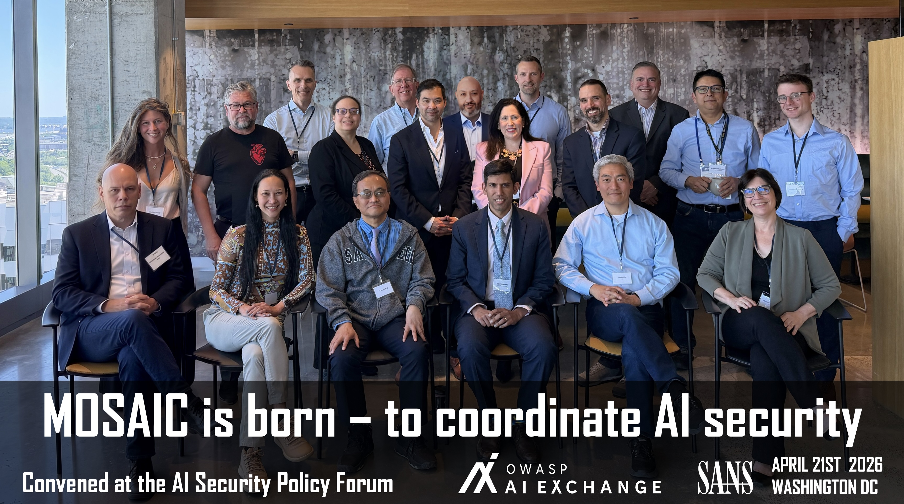

# MOSAIC

## What is the purpose of this Project?
MOSAIC provides a coordination structure for initiatives working on AI security standards and guidelines, reducing inconsistencies, duplicate work, misalignment, and gaps. 
The end goal is to let the standards and guideline landscape provide clear guidance for securing and overseeing the AI systems we increasingly connect to everything and trust with our sensitive data.

See [MOSAIC member organizations](docs/memberorganizations.md).  
See [roadmap](docs/roadmap.md).

More information in this [linkedin post](https://www.linkedin.com/posts/robvanderveer_on-april-21-2026-a-major-breakthrough-in-share-7454830488919281664-0Kja) and in the [notes of the launching meeting](docs/meeting-notes/20260521-MOSAIC-launch.md).

## Website

The public site is a Hugo static site (markdown content, shared layouts, CSS in `static/assets/`), deployed to Firebase Hosting from GitHub Actions.

- Live: https://mozaic-56ca8.web.app (custom domain TBD)
- **Edit page content:** [`content/mosaic/content/*.md`](content/mosaic/content/) (markdown only)
- **Edit navigation:** [`content/mosaic/data/menu.yaml`](content/mosaic/data/menu.yaml)
- **Full editing guide:** [docs/website.md](docs/website.md) — layouts, shortcodes, adding pages, CSS
- Preview URLs are posted on pull requests (3-day expiry)
- Maintainer scripts: see [CONTRIBUTING.md](CONTRIBUTING.md#website) (local build, Firebase release retention)

### Analytics

The site uses [GoatCounter](https://www.goatcounter.com/) for privacy-friendly, cookie-free page view statistics (`https://mosaic.goatcounter.com`). No personal data is collected. See [CONTRIBUTING.md](CONTRIBUTING.md#analytics) for details.

## How to use and contribute
To participate: see the [contribution guide](CONTRIBUTING.md). Discussions can be found [here](https://github.com/OWASP/MOSAIC/discussions).   
To read: see this README, the [docs folder](/docs), or the website.

Types of users:
- member organizations: coordinate as agreed
- non-member organizations: use the information on this platform as input to your plans and content, join discussions, make suggestions, become a member
- others: use the information on this platform to better understand and use the landscape of standards and platforms, join discussions, make suggestions, or perhaps join initiatives.

## What problem/need are you trying to solve/fulfill?
The promise of AI is pushing organizations to connect it to everything and entrust it with sensitive data. Across industries, this exploration is happening at speed.

At the same time, AI introduces new risks. Systems are vulnerable to both existing and novel types of attacks, and these require specific countermeasures. Many organizations are not yet prepared for this. As a result, AI systems are quickly becoming attractive targets for adversaries.

We already see this in a growing number of incidents. When risks materialize, innovation slows down: projects are paused, designs are revisited, and significant effort is spent on incident response and recovery. What looks like speed at the start often leads to delay later.

There is a clear need for practical guidance: how to identify AI-specific threats, and what to do about them. This does not need to be complex. When done right, it actually accelerates development by preventing rework and reducing uncertainty.

Today, many initiatives are working on such guidance. However, the landscape is fragmented. Practitioners are faced with multiple frameworks, overlapping recommendations, and inconsistent terminology. Each initiative has strengths, but also blind spots.

The result is confusion. Teams struggle to decide what to follow, combine incompatible approaches, or disengage entirely and rely on hope. That is a risky position, especially in a domain where failures can scale quickly.

A strong risk appetite in a fast-moving field like AI is understandable. But operating without clear and aligned security guidance is not a calculated risk—it is exposure. AI calls for strategic exploration.

Recent advances in AI vulnerability discovery, such as Mythos AI vulnerability discovery system, further increase urgency. They show that weaknesses in AI systems can now be found faster and at scale—often before developers are aware of them. This shifts the balance toward attackers and reduces the margin for error.

This is why coordination matters. Aligning standards and guidance across initiatives reduces fragmentation, improves clarity, and gives practitioners a coherent path forward. It enables organizations to move fast without losing control.
